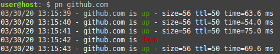
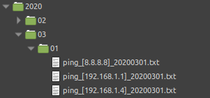

# Bash Ping Plus

A bash ping script with some extra features including:
* Colored output for up / down ping responses
* Log files are saved with date & time stamps inside nested folders by date
* Log files are dynamically generated, so if the ongoing ping rolls over into a new day, the target log file changes automatically





## Installation

Set the script as executable
```bash
chmod +x pn.sh
```

Edit the script (if desired) to change where ping logs are stored
```bash
logdir_base=~/ping_logs
```

Add symbolic link to your PATH (optional but recommended)
```bash
ln -s ~/location/of/pn.sh ~/.local/bin
```

## Usage

Host is required
```bash
pn [host] [packet size]
```

## Examples

Ping github with standard packets
```bash
pn github.com
```

Ping slashdot with large packets
```bash
pn slashdot.org 1500
```

Ping google dns
```bash
pn 8.8.8.8
```
